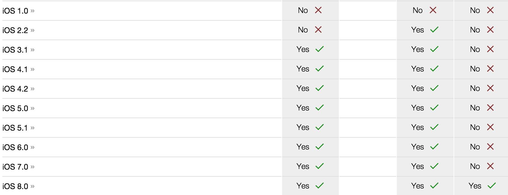
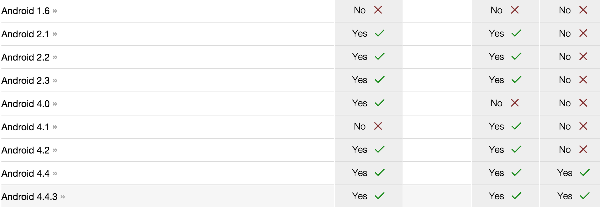
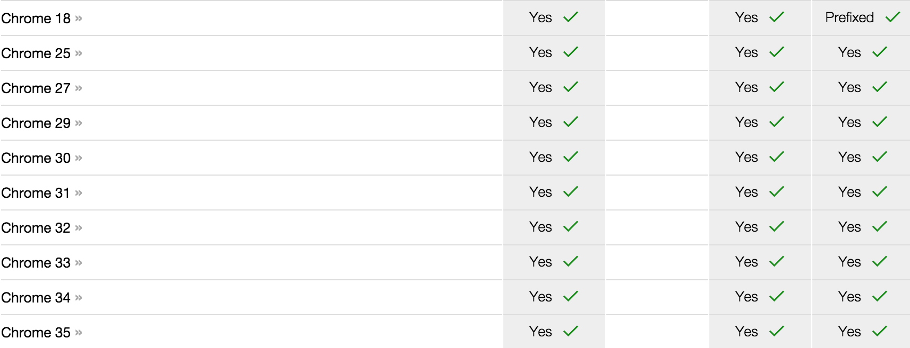

# mobile h5 storage

http://html5test.com/compare/feature/storage-localStorage/storage-sqlDatabase/storage-indexedDB.basic.html

一个残酷的现实。。。。。

## ios

## android

## chrome

# 设计

## deteck模块

检测顺序

1. webSQL
1. indexedDB
1. localStorage
1. memory + sifter.js

## api base类 

## cruds

- 增加
- 删除
- 修改
- 查询
- 搜索
